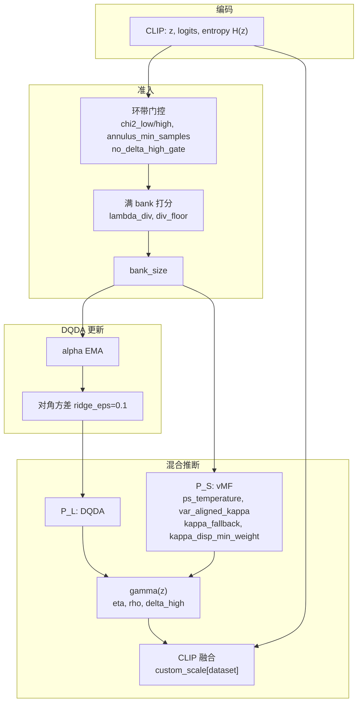

# vMFcache 超参数说明

本文档列出 `vMFcache.py` 中所有可配置超参数、其在算法中的角色，以及对应公式。记号：特征维度 \(d\)，类别数 \(K\)，每类 cache 容量 \(L\)（`bank_size`），单位球面特征 \(\mathbf{z}\in\mathbb{R}^d,\ \|\mathbf{z}\|=1\)。

---

## 1. 在线 TTA 总流程

对每个测试 batch，按顺序执行：

1. **CLIP 编码** → 零样本 logits 与预测 \(\hat{c}\)
2. **CLIP 熵** \(H(\mathbf{z})\) → 样本质量分数
3. **Cache 准入**（Mahalanobis 环带硬门控 + 熵/多样性联合打分）
4. **DQDA 参数更新**（每次准入后更新 \(\boldsymbol{\mu}_c,\ \boldsymbol{\sigma}^2_c\)）
5. **贝叶斯混合推断**（DQDA 似然 \(P_L\) + vMF 记忆 \(P_S\)，\(\gamma(\mathbf{z})\) 门控）
6. **与 CLIP 融合** → 最终分类 logits

---

## 2. 数据与模型

| 参数 | 默认值 | 含义 |
|------|--------|------|
| `--data` | `/home/liangyiwen/datasets` | 数据集根目录 |
| `--test_set` | `eurosat` | 测试数据集名（FG10 之一，可用 `/` 分隔多集） |
| `--arch` | `ViT-B/16` | CLIP 视觉骨干（如 `RN50`, `ViT-B/16`） |
| `--batch_size` | `1` | DataLoader batch 大小（在线逐 batch 处理；默认 1 为真在线） |
| `--gpu` | `0` | CUDA 设备编号 |
| `--seed` | `0` | 随机种子 |

### CLIP 零样本 logits

\[
\mathbf{z} = \frac{f_{\text{CLIP}}(\mathbf{x})}{\|f_{\text{CLIP}}(\mathbf{x})\|}, \qquad
\boldsymbol{\ell}^{\text{clip}} = 100 \cdot \mathbf{z}\, \mathbf{W}^\top
\]

其中 \(\mathbf{W}\in\mathbb{R}^{K\times d}\) 为预提取的类别文本嵌入（由 `--class_type` 与 `--GPT` 决定路径）。

| 参数 | 默认值 | 含义 |
|------|--------|------|
| `--class_type` | `Custom` | 文本 prompt 类型：`Custom` / `Vanilla` / `Img_temp` / `Ensemble` |
| `--GPT` | `False` | 是否使用 GPT 生成的类别描述增强 prompt |

---

## 3. Cache 与 DQDA 更新

### 3.1 Cache 结构

每类维护 \(L\) 个 slot，存储 \((\mathbf{v}_m,\ \hat{c}_m,\ \mathbf{p}_m,\ e_m)\)。初始为空（label = \(-1\)）。

| 参数 | 默认值 | 含义 |
|------|--------|------|
| `--bank_size` | `16` | 每类 cache 容量 \(L\) |

### 3.2 在线 DQDA 均值更新（EMA 收缩到文本原型）

每次样本准入类 \(\hat{c}\) 后，用该类 cache 中软标签加权均值更新 \(\boldsymbol{\mu}_{\hat{c}}\)：

\[
\tilde{\boldsymbol{\mu}}_{\hat{c}} =
\frac{\sum_{m\in\mathcal{M}_{\hat{c}}} w_m \mathbf{v}_m + w_{\text{new}}\mathbf{z}}
     {\sum_{m\in\mathcal{M}_{\hat{c}}} w_m + w_{\text{new}}}
\]

\[
\boldsymbol{\mu}_{\hat{c}} \leftarrow \alpha\,\tilde{\boldsymbol{\mu}}_{\hat{c}} + (1-\alpha)\,\boldsymbol{\mu}^{\text{text}}_{\hat{c}}
\]

| 参数 | 默认值 | 含义 |
|------|--------|------|
| `--alpha` | `0.9` | EMA 系数 \(\alpha\)：越大越信任 cache 统计，越小越靠近 CLIP 文本原型 \(\boldsymbol{\mu}^{\text{text}}\) |

### 3.3 对角协方差估计

对类 \(c\)，设该类中心化样本为 \(\{\mathbf{v}_m - \boldsymbol{\mu}_c\}\)：

\[
\hat{\boldsymbol{\sigma}}^2_c = (1-\varepsilon)\,\mathrm{Var}(\mathbf{v}_m - \boldsymbol{\mu}_c) + \varepsilon\,\hat{\boldsymbol{\sigma}}^2_{\text{pooled}}
\]

代码中 \(\varepsilon = 0.1\)（`ridge_eps`，**非 CLI 参数**，固定常数），\(\hat{\boldsymbol{\sigma}}^2_{\text{pooled}}\) 为所有 cache 样本的池化方差。最终 \(\sigma^2_{c,j} \leftarrow \max(\sigma^2_{c,j}, 10^{-4})\)。

---

## 4. 样本质量：CLIP 熵

用于 cache 准入打分，衡量 CLIP 零样本预测的 softmax 熵（越低越好，表示预测越自信）。

\[
\boldsymbol{\ell}^{\text{clip}} = 100 \cdot \mathbf{z}\mathbf{W}^\top, \qquad
p = \mathrm{softmax}(\boldsymbol{\ell}^{\text{clip}})
\]

\[
H(\mathbf{z}) = -\sum_{c} p_c \log p_c
\]

无额外 CLI 参数；熵在 `encode_batch()` 中与 CLIP logits 一并计算。

---

## 5. Cache 准入：Mahalanobis 安全环带

### 5.1 Mahalanobis 距离

对预测类 \(\hat{c}\)：

\[
D_M(\mathbf{z},\hat{c}) = \sqrt{\sum_{j=1}^{d} \frac{(z_j - \mu_{\hat{c},j})^2}{\sigma^2_{\hat{c},j}}}
\]

### 5.2 经验分位数阈值

在线收集历史 \(D_M\)，样本数 \(\geq N_{\min}\) 后激活环带：

\[
\delta_{\text{low}} = Q_{q_{\text{low}}}(D_M), \qquad
\delta_{\text{high}} = Q_{q_{\text{high}}}(D_M)
\]

| 参数 | 默认值 | 含义 |
|------|--------|------|
| `--chi2_low` | `0.05` | 下分位数 \(q_{\text{low}}\)（历史命名，现为经验分位数） |
| `--chi2_high` | `0.95` | 上分位数 \(q_{\text{high}}\) |
| `--annulus_min_samples` | `200` | 激活环带前最少累积 \(D_M\) 样本数 \(N_{\min}\) |

### 5.3 硬门控规则

DQDA 参数就绪后，候选样本若满足以下任一则**拒绝准入**：

\[
D_M < \delta_{\text{low}} \quad \text{或} \quad D_M > \delta_{\text{high}}\ (\text{若启用上界})
\]

| 参数 | 默认值 | 含义 |
|------|--------|------|
| `--no_delta_high_gate` | `False` | 设为 `True` 时关闭上界门控，仅保留 \(D_M < \delta_{\text{low}}\) 拒绝 |

### 5.4 满 bank 时的联合打分与淘汰

当类 \(\hat{c}\) 的 cache 已满，在「现有 \(L\) 个 + 候选」共 \(L{+}1\) 个成员上计算：

\[
r_i = \max_{j\neq i} \cos(\mathbf{u}_i, \mathbf{u}_j), \qquad
\tilde{r}_i = \max(0,\ r_i - \tau_{\text{div}})
\]

\[
s_i = -e_i - \lambda_{\text{div}}\,\tilde{r}_i
\]

淘汰 \(s_i\) **最小**的成员；若候选得分最低则拒绝准入。

| 参数 | 默认值 | 含义 |
|------|--------|------|
| `--lambda_div` | `1.0` | 多样性惩罚权重 \(\lambda_{\text{div}}\) |
| `--div_floor` | `0.5` | 余弦相似度地板 \(\tau_{\text{div}}\)（\(\tilde{r}=\max(0,r-\tau_{\text{div}})\)） |

---

## 6. 贝叶斯混合后验

### 6.1 DQDA 似然分支 \(P_L\)

对角 QDA 判别分数：

\[
\log p_L(\mathbf{z}\mid c) = -\frac{1}{2}\left(\sum_j \log\sigma^2_{c,j} + \sum_j \frac{(z_j-\mu_{c,j})^2}{\sigma^2_{c,j}}\right)
\]

\[
P_L(c\mid\mathbf{z}) = \mathrm{softmax}_c\bigl(\log p_L(\mathbf{z}\mid c)\bigr)
\]

### 6.2 vMF 记忆分支 \(P_S\)

对类 \(c\)，cache 中成员集合 \(\mathcal{M}_c\)，原型方向 \(\mathbf{v}_m\)，浓度 \(\kappa_c\)：

\[
\log p_S(\mathbf{z}\mid c) = \log C_d(\kappa_c) + \log\sum_{m\in\mathcal{M}_c}\exp(\kappa_c\,\mathbf{z}^\top\mathbf{v}_m) - \log|\mathcal{M}_c|
\]

vMF 归一化常数（代码 `log_vmf_normalizer`）：

\[
\log C_d(\kappa) = \left(\frac{d}{2}-1\right)\log\kappa - \frac{d}{2}\log(2\pi) - \log I_{d/2-1}(\kappa) - \kappa
\]

#### 模式 A：固定 \(\kappa\)（未开启 `--var_aligned_kappa`）

\[
\kappa = \frac{1}{\texttt{kappa\_tau}}, \qquad P_S = \mathrm{softmax}(\log p_S)
\]

#### 模式 B：方差对齐 \(\kappa\)（`--var_aligned_kappa`）

每类从在线软标签分散度估计 \(\kappa_c\)：

\[
\mathbf{R}_c = \frac{\sum_i w_{i,c}\,\mathbf{z}_i}{\sum_i w_{i,c}}, \qquad
R_c = \|\mathbf{R}_c\|
\]

通过 \(A_d(\kappa_c) = R_c\) 二分求解 MLE 浓度（\(A_d\) 为 Bessel 函数比），有效权重不足时用 fallback：

\[
\kappa_c = \begin{cases}
\text{MLE}(R_c) & \sum_i w_{i,c} \geq w_{\min} \\
\kappa_{\text{fb}} & \text{otherwise}
\end{cases}
\]

\[
P_S = \mathrm{softmax}\!\left(\frac{\log p_S}{T_{\text{ps}}}\right)
\]

| 参数 | 默认值 | 含义 |
|------|--------|------|
| `--kappa_tau` | `0.01` | 固定模式：vMF 浓度 \(\kappa = 1/\texttt{kappa\_tau}\) |
| `--ps_temperature` | `175` | var_aligned 模式：\(P_S\) 温度 \(T_{\text{ps}}\) |
| `--var_aligned_kappa` | `False` | 启用每类 MLE \(\kappa_c\) + `ps_temperature` 校准 |
| `--kappa_disp_min_weight` | `2.0` | 估计 \(\kappa_c\) 的最小软标签累积权重 \(w_{\min}\) |
| `--kappa_fallback` | `2000.0` | 权重不足时的默认 \(\kappa_{\text{fb}}\) |

> **生产脚本示例**（`scripts/run_eurosat.sh`）使用 `--var_aligned_kappa --ps_temperature 175`。

### 6.3 \(\gamma(\mathbf{z})\) 门控（Mahalanobis 自适应混合）

\[
D_M(\mathbf{z}) = D_M(\mathbf{z},\, \arg\max_c \log p_L(\mathbf{z}\mid c))
\]

\[
\gamma(\mathbf{z}) = \mathrm{clip}\!\left(1 - \eta\left(\frac{D_M(\mathbf{z})}{\delta_{\text{high}}}\right)^{\rho},\ 0,\ 1\right)
\]

\[
\text{mix}(c\mid\mathbf{z}) = \gamma\, P_L(c\mid\mathbf{z}) + (1-\gamma)\, P_S(c\mid\mathbf{z})
\]

| 参数 | 默认值 | 含义 |
|------|--------|------|
| `--eta` | `0.75` | 门控强度 \(\eta\) |
| `--rho` | `2.0` | 门控指数 \(\rho\) |

### 6.4 先验与后验

固定均匀先验（代码硬编码，无 CLI 参数）：

\[
\pi_c = \frac{1}{K}
\]

\[
\text{post}(c\mid\mathbf{z}) = \frac{\pi_c\cdot \text{mix}(c\mid\mathbf{z})}{\sum_{c'}\pi_{c'}\cdot \text{mix}(c'\mid\mathbf{z})}
\]

### 6.5 与 CLIP 融合

\[
\boldsymbol{\ell}^{\text{test}} = \boldsymbol{\ell}^{\text{clip}} \odot \exp\!\left(\frac{\log \text{post}}{\text{scale}}\right)
\]

`scale` 为**数据集相关常数**（非 CLI），来自 `data/cls_to_names.py` 的 `custom_scale`：

| 数据集 | scale |
|--------|-------|
| oxford_pets, eurosat, fgvc_aircraft, food101, caltech101 | 100.0 |
| oxford_flowers, stanford_cars, dtd, sun397 | 60.0 |
| ucf101 | 70.0 |

| 参数 | 默认值 | 含义 |
|------|--------|------|
| `--clip_weight` | `1.0` | **当前代码未使用**（保留参数，融合公式中无此项） |

---

## 7. 调试与可视化

| 参数 | 默认值 | 含义 |
|------|--------|------|
| `--diag_stats` | `False` | 打印准入/混合后验统计（熵、冗余度、\(\gamma\)、\(\kappa_c\) 等） |
| `--cache_tsne_viz` | `False` | 评估结束后绘制 cache vs 测试特征 t-SNE |
| `--cache_tsne_output` | `None` | 输出 PNG 路径（默认 `scripts/figures/cache_tsne_<dataset>_bs<L>.png`） |
| `--cache_tsne_max_classes` | `10` | 可视化保留类数上限（0 = 全部） |
| `--cache_tsne_max_bg` | `4000` | 背景点下采样上限 |
| `--cache_tsne_perplexity` | `30.0` | t-SNE perplexity |
| `--cache_tsne_iter` | `1000` | t-SNE 迭代次数 |
| `--cache_tsne_bg_alpha` | `0.45` | 非 cache 点透明度 |

---

## 8. 超参数关系速查



---

## 9. 推荐起步配置

与 `scripts/run_eurosat.sh` 一致的生产默认：

```bash
--bank_size 16 --alpha 0.9 \
--var_aligned_kappa --ps_temperature 175 \
--eta 0.75 --rho 2.0 \
--chi2_low 0.05 --chi2_high 0.95 --annulus_min_samples 200 \
--lambda_div 1.0 --div_floor 0.5
```
